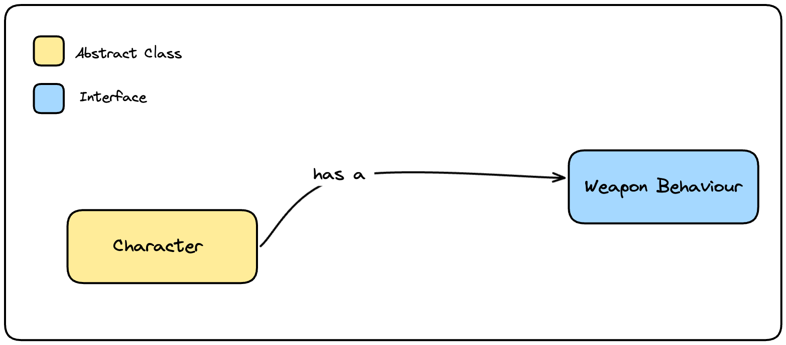
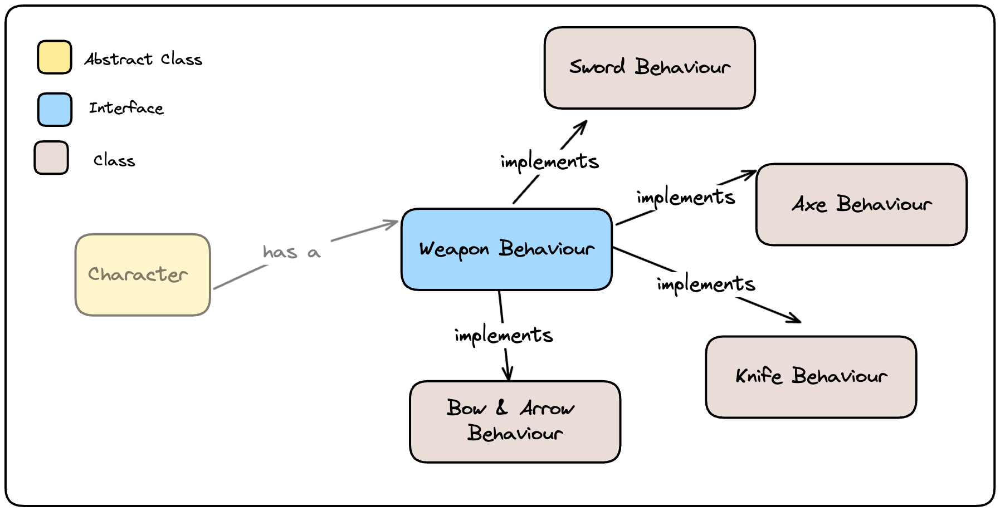

- **Characteristics** : Composition, Polymorphism
- **Type** : Object Orientated

The strategy pattern is an excellent pattern for grouping algorithms with similar behaviours behind one interface. It enables runtime polymorphism by swapping out the underlying classes that implement the interface.

### Steps
1. Define a family of related algorithms.
2. Encapsulate each one to make them interchangeable.

### Example
Lets see the strategy pattern in action in a Object Orientated Hierarchy for a Medieval game.

#### Define Base
1. Define the base abstract class for all the characters.
2. Add a `Weapon Behaviour` interface to the base Abstract Class to compose characters with different weapons.

#### Define Weapon Behaviours
1. Add classes for each type of weapon behaviour.

#### Compose Characters (with behaviours)
1. For each type of character, create a class that extends the base character class and adds a Weapon Behaviour in the constructor.

