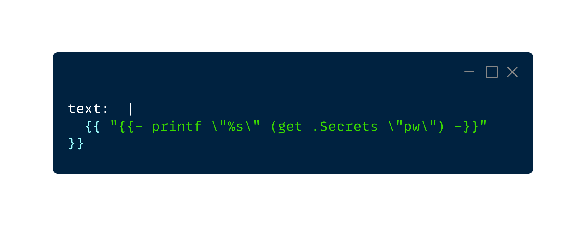

I had a tricky problem while using a Helm chart that required consuming a GO template: how could the Helm compiler stop interpolating the curly brackets? It took me longer than I'd like to admit to diagnose this issue. Below is my initial attempt at ensuring that the Helm compiler doesn't interpolate the double curly brackets.

